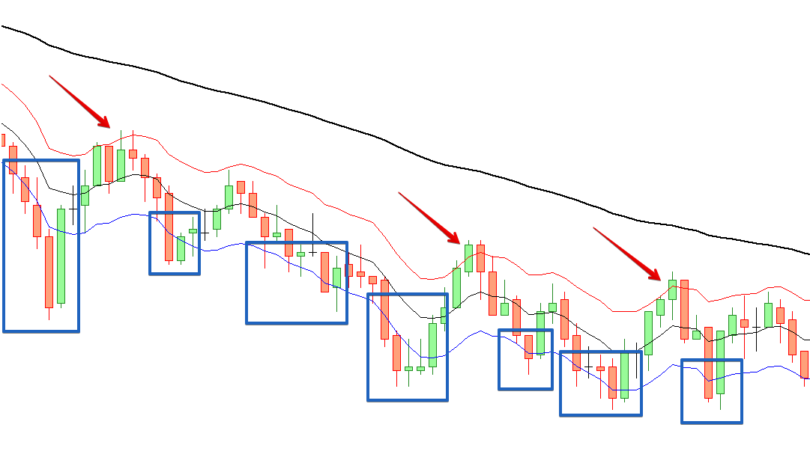

Os filtros de entrada tem o papel de impedir uma entrada que poderia ser perigosa ou muito agressiva, como por exemplo um movimento muito brusco, ou ainda filtrar uma compra quando outro indicador está indicando venda (e vice versa). No geral, os indicadores de filtro de entrada são mais úteis em setups mais conservadores e/ou que operam à favor da tendência, já que setups contra tendência são essencialmente agressivos e precisam da volatilidade para operar com eficiência

## Filtro de Média Movel

- **Usar tendência por média móvel:** Se ligado, o robô fará apenas operações a favor da tendência da média móvel configurada.

- **Período da média móvel:** Período da média móvel exponencial usada para indicar a tendência

Abaixo exemplo visual de um setup M10 DX50 contra tendência com todas as compras canceladas (regiões em azul) pelo filtro de tendência de média móvel de período 80. Tambem no exemplo, indicado pelas setas vermelhas as vendas válidas. Os outros funcionam da mesma forma na validação do sinal:

    
    
Setup M10 DX50 com filtro de tendência média móvel de 80 períodos

## Filtro VWAP

- **Usar tendência por VWAP:** Se ligado, o robô fará apenas operações a favor da tendência da VWAP configurada.

- **Período da VWAP:** Período usado no indicador VWAP, sendo um dos 3: diário, semanal ou mensal.

- **Ignorar entradas por distância mínima**: Se maior do que 0 (zero), o robô irá gnorar entradas que estejam à esta distância em pontos da VWAP, acima e abaixo. Exemplo: se a VWAP está em 90.000, e o valor deste parâmetro está em 250, o robô não fará entradas se o preço estiver entre <ins>90.250</ins>, e <ins>89.750</ins>

## Filtro HiLo

- **Usar tendência por HiLo:** Se ligado, o robô fará apenas operações a favor da tendência do indicador HiLo configurado.

- **Período do HiLo:** Período usado no indicador HiLo.

- **Suavização do HiLo:** Tipo de suavização usado para calcular.

## Filtro SuperTrend

- **Usar tendência por SuperTrend:** Se ligado, o robô fará apenas operações a favor da tendência do indicador SuperTrend configurado. O cálculo desse indicador usa 2 outros indicadores técnicos, o CCI (Commodity Channel Index) e o ATR (Average True Range).

- **Período do CCI:** Período usado do CCI do SuperTrend.

- **Cálculo do Preço do CCI:** Tipo de preço usado no CCI do SuperTrend.

- **Período do ATR:** Período do ATR.

## Filtro Volume

- **Usar Volume:** Se ligado, o robô irá filtrar entradas de acordo com o valor da média do volume configurado.

- **Direção do Filtro:** Se o valor estiver configurado em <ins>Operar Abaixo</ins>, o robô somente permitirá entradas caso o valor da média do volume for inferior ao da média configurada. Logo ,se o valor estiver confiugurado em <ins>Operar Acima</ins>, o robô apenas permitirá entradas caso o valor da média do volume for superior ao da média configurada. 

- **Tipo do Volume:** A quantidade de trades do candle é representada pelo tipo "Tick". A quantidade de contratos é representada pelo tick "Real".

- **Período da Média:** Período da média movel a ser calculada em cima do volume.

## Filtro Amplitude

- **Usar Amplitude:** Se ligado, o robô filtrará operações de acordo com a amplitude do preço de referência.

- **Referência do preço:** Tipo do preço a ser usado como referência do filtro de amplitude.

- **Direção do Filtro:** "<ins>Libera acima da amplitude máxima</ins>:" O robô irá monitorar o preço em relação à distância do preço de referência em pontos configurada. Por exemplo, se a distância for 500 no WIN, o robô irá liberar operações somente se o preço se distanciar 500 ou mais pontos do preço de referência. Vale para cima ou para baixo. A outra opção "<ins>Libera abaixo da amplitude máxima</ins>" funciona de forma inversa.

- **Distância em pontos da referência:** Distância em pontos que o robô vai considerar para liberar ou travar as operações dependendo da direção configurada.

## Filtro RSI (Ou IFR - Índice de Força Relativa) 

- **Usar RSI:** Se ligado, bloqueia ou libera operações de acordo com a configuração do filtro.

- **Período:** Período usado no indicador RSI.

- **Sobrecomprado:** Nível a ser considerado sobrecomprado. Se o valor do RSI estiver <ins>acima</ins> deste valor, o filtro libera qualquer entrada (compra se estiver configurado à favor da tendência ou venda se tiver contra tendência)

- **Sobrevendido:** Nível a ser considerado sobrevendido. Se o valor do RSI estiver <ins>abaixo</ins> deste valor, o filtro libera qualquer entrada (compra se estiver configurado à favor da tendência ou venda se tiver contra tendência)