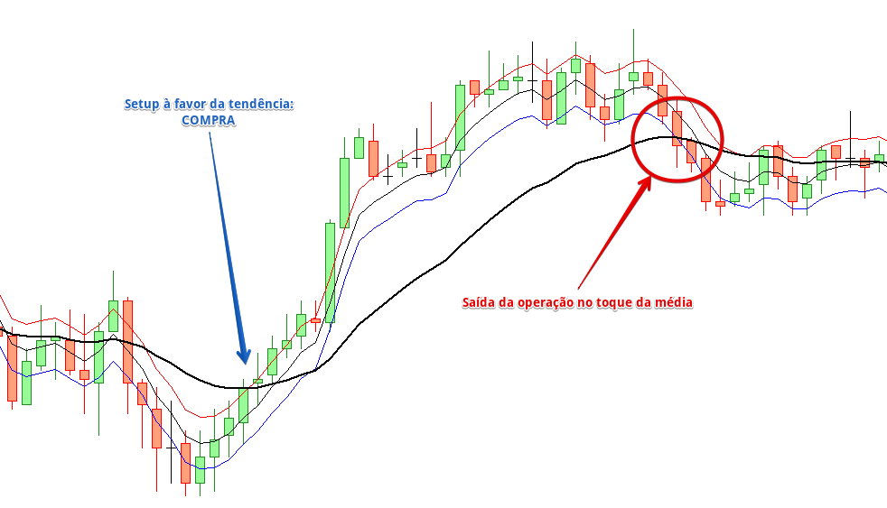
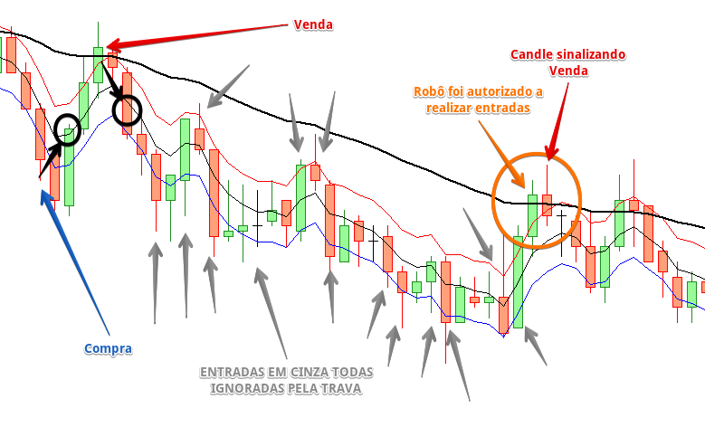

Os Parâmetros de proteção aumentam estatisticamente a segurança das operações. Elementos como break even, trailing stop, saídas no toque da média e trava de re-entrada garantem um nível de segurança e proteção das operações bastante alto.

Não é aconselhado o uso de todas as configurações (ou a maioria) simultaneamente. Cada tipo de proteção tem sua utilidade dependendo do tipo de setup desejado.

## Break Even

O Break Even possui 4 níveis, que trabalham de forma semelhante ao trailing stop (ou stop móvel). A diferença é que no break even você tem o controle da distância e proteção individualmente, mas limitados somente à 4 niveis.

- **Referência do preço:**: Define o preço a ser a referência da operação, se preço médio ou o preço de entrada.

- **(1~4) Distância em pontos:** Distância em pontos do preço entrada que ao atingir o robô fará o reajuste do Stop Loss

- **(1~4) Ganho mínimo em pontos:** Distância em pontos do preço de entrada que será usada como proteção da operação

## Trailing Stop

- **Referência do preço de ativação:** Define o preço a ser a referência da operação, se preço médio ou o preço de entrada.

- **Remove o Take Profit ao iniciar o Trailing Stop:** Se ativado. ao realizar a primeira proteção (ou ao realizar a primeira modificação do stop), o robô remove o take profit. Desta forma a operação fica sem alvo, e num mercado direcional pode atingir alvos mais longos

- **Ativa a partir de X pontos (0 ativa imediatamente):** Distância em pontos a partir do preço entrada que ao atingir o robô fará o <ins>acionamento</ins> do trailing stop. Neste momento não há é realizado nenhum ajuste do stop loss. Se 0, o trailing já está ativo e realizará a alteração do stop loss assim que atingir a distância do preço de entrada

- **Distância em pontos (0 não usar):** Distância em pontos a partir do <ins>preço atual</ins> que o robô fará o ajuste do stop loss

- **Passos em pontos (0 não usar):** Intervalo em pontos a partir do <ins>preço de ativação</ins> que o trailing fará o reajuste do stop loss

## Média de Saída Primária

O Robô Galton possui 2 médias de saída, que podem ser usadas em conjunto ou separadamente.

O toque na saída da média pode ser usado tanto em <ins>setups conservadores</ins> para alvos mais longos como para <ins>setups agressivos</ins> para proteção de movimentos bruscos do mercado.

A média de saída primária é uma média móvel configurável onde o robô encerrará a operação imediatamente caso o preço toque na mesma.

- **Usar média de saída primária:** Liga ou desliga a média de proteção primária
  
- **Saída dependende do lucro da posição:** Se ativado, o toque só será válido se a operação estiver no lucro. Caso negativo, a saída ocorrerá normalmente.

- **Período da média de saída primária:** Período da média móvel de saída primária

- **Suavização da média de saída primária:** Tipo de suavização da média de saída primária

- **Cálculo da média de saída primária:** Preço usado no cálculo da média de saída primária

Abaixo, um exemplo visual de um setup à favor da tendência com saída no toque na média primária:

    
    
Setup à favor da tendência com saída no toque da média de saída primária

## Média de Saída Secundária

A média de saída secundária funciona exatamente da mesma forma que a primária, podendo ser usado em conjunto ou não. O diferencial está na opção condicional da ativação. Esta média pode ser ativada somente caso o robô faça "x" aumentos de posição.

- **Usar média de saída secundária:** Liga ou desliga a média de proteção secundária. Opções: <ins>Sim</ins>, <ins>Não</ins> ou <ins>Após "X" aumentos</ins>

- **Saída dependende do lucro da posição:** Se ativado, o toque só será válido se a operação estiver no lucro. Caso negativo, a saída ocorrerá normalmente.

- **Aumentos mínimos:** Aumentos mínimos que o robô deve realizar antes de ativar a média secundária. Se o valor for 0 (zero), a média nao será usada

- **Período da média de saída secundária:** Período da média móvel de saída secundária

- **Suavização da média de saída secundária:** Tipo de suavização da média de saída secundária

- **Cálculo da média de saída secundária:** Preço usado no cálculo da média de saída secundária

## Trava de Re-Entrada

A trava de re-entrada é uma média configurável onde, caso ativada, passa a ser monitorada **apenas após uma saída de operação**, seja com saldo positivo ou negativo.

A partir deste momento, o robô não fará mais nenhuma entrada, ignorando qualquer sinal. Após o preço tocar nesta média configurada, o robô está liberado para fazer novas leituras de sinais de entrada

- **Usar trava de re-entrada:** Liga ou desliga a trava de re-entrada
 
- **Ativação dependende do lucro da operação fechada:** Liga ou desliga a trava (apenas se a opção acima estiver ativada, obviamente) dependendo do valor monetário da operação fechada. Se indiferente (não), se lucro ou prejuízo.

- **Período da média da trava de re-entrada:** Período da média móvel da trava de re-entrada

- **Suavização da média da trava de re-entrada:** Tipo de suavização da média da trava de re-entrada

- **Cálculo da média da trava de re-entrada:** Preço usado no cálculo da média da trava de re-entrada

## Exemplo

Abaixo um exemplo visual de uma trava de re-entrada em ação. Primeira seta azul comprou normalmente e atingiu o seu alvo no círculo preto. A trava foi ativada. O preço subiu e atravessou a trava (média preta).

Ao atingir a média o robô foi liberado a ler sinais de entrada, e logo em seguida deu sinal de venda (seta vermelha), que atingiu o take profit rapidamente (círculo preto). A partir deste momento, a trava é ligada novamente, e todos os sinais foram ignorados (setas em cinza).

O robô só é autorizado a realizar novas entradas após o preço tocar na média da trava (círculo laranja), o que faz o robô ler um sinal de venda logo em seguida:

    
    
Setup contra tendência com trava de re-entrada

